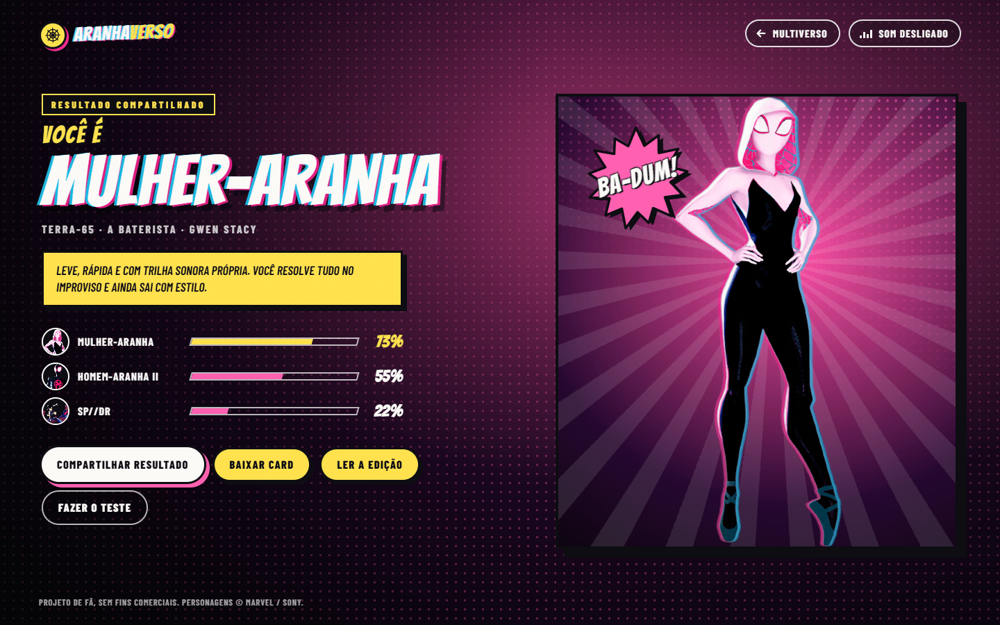

# Aranhaverso

Uma revista em quadrinhos interativa com os heróis do Aranhaverso: abertura em retícula, troca de universo com glitch dimensional, uma edição em painéis para cada herói e o teste "Qual Aranha é você?".

**[Ver ao vivo](https://leandromlmoreira.github.io/spiderverse/)**


| Edição do herói | Qual Aranha é você? | Celular |
|---|---|---|
|  |  |  |

## Funcionalidades

- **Abertura de cinema**: o logo se monta em retícula, com as chapas ciano, magenta e amarelo entrando em registro, e a tela se parte em dois painéis para revelar o palco. Pula com qualquer tecla ou toque e roda só uma vez por visita.
- **Palco do multiverso**: herói no centro com respiração sutil, giro em 3D seguindo o mouse e vizinhos desfocados em profundidade. Troque pelas setas, pelo teclado (← →), pelo índice de universos ou arrastando.
- **Glitch dimensional mais rápido**: a troca fatia o herói, desalinha as cores como impressão fora de registro e dispara linhas cinéticas e uma explosão de retícula na direção do movimento.
- **Onomatopeias com personalidade**: cada universo tem a sua (THWIP!, BA-DUM!, ZAP!, BZZT!, OINK!, BANG!, ZWOOM!), com letras que saltam uma a uma e um movimento próprio: estica, pulsa no compasso, dá choque, falha, balança, soca ou acelera.
- **Contador de edição**: selo "Nº" com dígitos que rolam e uma barra segmentada do índice.
- **Arrasto no celular**: trava de direção, limite proporcional à tela, inclinação pela velocidade do dedo, vibração curta na troca e uma dica de arrasto na primeira visita.
- **Edição do herói** (`/hero/<id>`): splash com o herói saindo do quadro, ficha secreta, painel de diálogo com balões de fala, grito e pensamento no tom de cada Aranha, carta de poder colecionável com barras de atributos, habilidades e brilho holográfico, curiosidades em painéis inclinados, régua de altura, balança de peso e primeira aparição com autores.
- **Vire a página**: anterior e próxima com canto dobrado e uma transição de folha virando em 3D, também pelo teclado (← →).
- **Qual Aranha é você?** (`/quiz/`): seis perguntas, resultado com compatibilidade dos três Aranhas mais próximos, link compartilhável que reabre o mesmo resultado e um card em PNG gerado no navegador para postar.
- **Som opcional**: voz de cada herói e efeitos sintetizados com Web Audio (troca, clique, virada de página, carimbo do resultado). Desligado por padrão, preferência lembrada entre visitas.
- **Acessível**: foco visível, navegação por teclado em todas as telas, anúncio do herói atual para leitores de tela, textos alternativos, `prefers-reduced-motion` respeitado (sem abertura, glitch nem virada 3D) e layout pensado para 375 px.

## Stack

- [Next.js 15](https://nextjs.org/) (App Router, export estático) + React 19
- TypeScript
- [Framer Motion](https://motion.dev/) para palco, arrasto, parallax, painéis e transições
- Sass (CSS Modules), Web Audio API e Canvas 2D
- Fontes Bangers e Barlow Condensed (Google Fonts)
- ESLint + Prettier

## Como rodar

Pré-requisito: Node.js 18.18 ou mais recente.

```bash
git clone https://github.com/leandromlmoreira/spiderverse.git
cd spiderverse
npm install
npm run dev
```

Abra [http://localhost:3000/spiderverse](http://localhost:3000/spiderverse).

| Comando | O que faz |
|---|---|
| `npm run dev` | ambiente de desenvolvimento |
| `npm run build` | gera o site estático em `out/` |
| `npm run lint` | roda o ESLint |

## Dados dos heróis

As páginas tentam buscar a lista de heróis na API configurada em `next.config.ts` (`API_URL`). Se a requisição falhar ou vier em formato inesperado, o site usa o arquivo local `src/app/api/heroes/heroes.json`, então funciona normalmente sem a API externa. Paleta e onomatopeia de cada universo ficam em `src/app/data/universes.ts`; falas, atributos, habilidades e curiosidades em `src/app/data/lore.ts`; as perguntas do teste em `src/app/data/quiz.ts`. Heróis sem ficha própria recebem valores padrão.

## Deploy

Export estático (`output: "export"`, `basePath: "/spiderverse"`) publicado no GitHub Pages pelo workflow `.github/workflows/deploy-pages.yml` a cada push na `main`.

## Estrutura

```
src/app/
├── page.tsx                 # palco do multiverso
├── hero/[id]/page.tsx       # edição do herói em painéis
├── quiz/page.tsx            # Qual Aranha é você?
├── data/                    # heróis com fallback, universos, ficha e perguntas do teste
├── components/
│   ├── Opening/             # abertura com logo em retícula
│   ├── Multiverse/          # palco, parallax, glitch, contador e índice de universos
│   ├── ComicIssue/          # painéis da edição, carta de poder e navegação de página
│   ├── Quiz/                # perguntas, resultado e card compartilhável
│   ├── PageTransition/      # cortina CMYK e virada de página
│   ├── Sound/               # preferência de som, vozes e efeitos sintetizados
│   ├── Starburst/           # balão de onomatopeia em SVG
│   ├── FanNotice/           # aviso de projeto de fã
│   └── Wordmark/            # logotipo
├── hooks/                   # useGlitch, useMediaQuery
└── lib/                     # formatação de datas e medidas
public/
├── spiders/                 # recortes dos heróis (WebP) e capas
└── songs/                   # áudios de cada herói
```

---

<sub>Projeto de fã, sem fins comerciais. Personagens, nomes e capas © Marvel / Sony; todos os direitos pertencem aos seus detentores. Base original: projeto guiado "Criando um carrossel Parallax do Aranha Verso com React, Next.js, TypeScript e Framer Motion".</sub>
