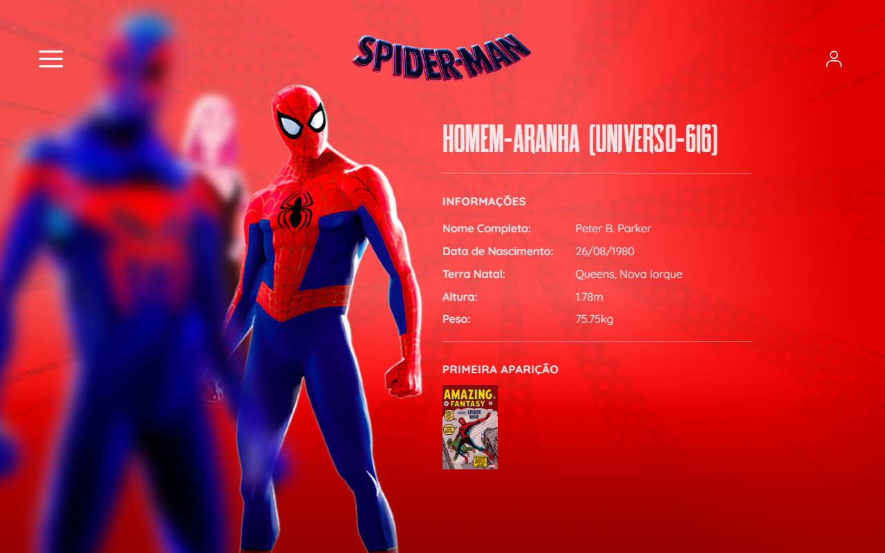

# Spiderverse — Galeria de Heróis

Carrossel com efeito parallax dos heróis do Aranha-Verso, com uma página de detalhes por personagem, trilha sonora e visual próprios de cada universo.

**[Ver ao vivo](https://leandromlmoreira.github.io/spiderverse/)**



## Funcionalidades

- Carrossel com 3 heróis visíveis e troca por arrastar (mouse) ou deslizar (touch).
- Fundo da página e áudio mudam de acordo com o herói em destaque.
- Painel de detalhes: nome completo, data de nascimento, terra natal, altura, peso e capa da primeira aparição.
- Rota por herói: `/hero/<id>` abre o carrossel já no herói escolhido (ex.: `/hero/spider-ham-8311`).
- Layout responsivo, com estados de foco visível para navegação por teclado.

## Stack

- [Next.js 15](https://nextjs.org/) (App Router) + React 19
- TypeScript
- [Framer Motion](https://motion.dev/) para as animações
- Sass (CSS Modules)
- ESLint + Prettier

## Como rodar

Pré-requisito: Node.js 18.18 ou mais recente.

```bash
git clone https://github.com/leandromlmoreira/spiderverse.git
cd spiderverse
npm install
npm run dev
```

Abra [http://localhost:3000/spiderverse](http://localhost:3000/spiderverse).

Outros scripts:

| Comando | O que faz |
|---|---|
| `npm run build` | gera o site estático em `out/` |
| `npm start` | sobe o build de produção |
| `npm run lint` | roda o ESLint |

## Dados dos heróis

Os dados de cada herói vêm do arquivo local `src/app/api/heroes/heroes.json`. As páginas tentam primeiro buscar a mesma lista na API pública configurada em `next.config.ts` (`API_URL`, um endpoint do MockAPI) e, se a requisição falhar, usam o arquivo local — o site funciona normalmente mesmo sem a API externa.

## Deploy

O site é publicado como export estático (`output: "export"`) no GitHub Pages via GitHub Actions a cada push na `main` (veja `.github/workflows/deploy-pages.yml`).

## Estrutura

```
src/app/
├── page.tsx               # home: carrossel com todos os heróis
├── hero/[id]/page.tsx     # carrossel começando no herói da URL
├── api/heroes/            # heroes.json (fonte local dos dados)
├── components/
│   ├── Carousel/          # carrossel, troca de herói, fundo e áudio
│   ├── HeroDetails/       # painel de informações do herói
│   ├── HeroPicture/       # imagem de cada herói
│   └── HeroesList/        # grade de heróis com link para /hero/<id> (não usada nas páginas hoje)
├── interfaces/heroes.tsx  # tipo IHeroData
└── fonts/                 # fonte do logo
public/
├── spiders/               # imagens, fundos e capas dos quadrinhos
└── songs/                 # áudios de cada herói e da transição
```
