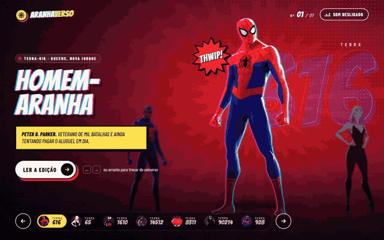
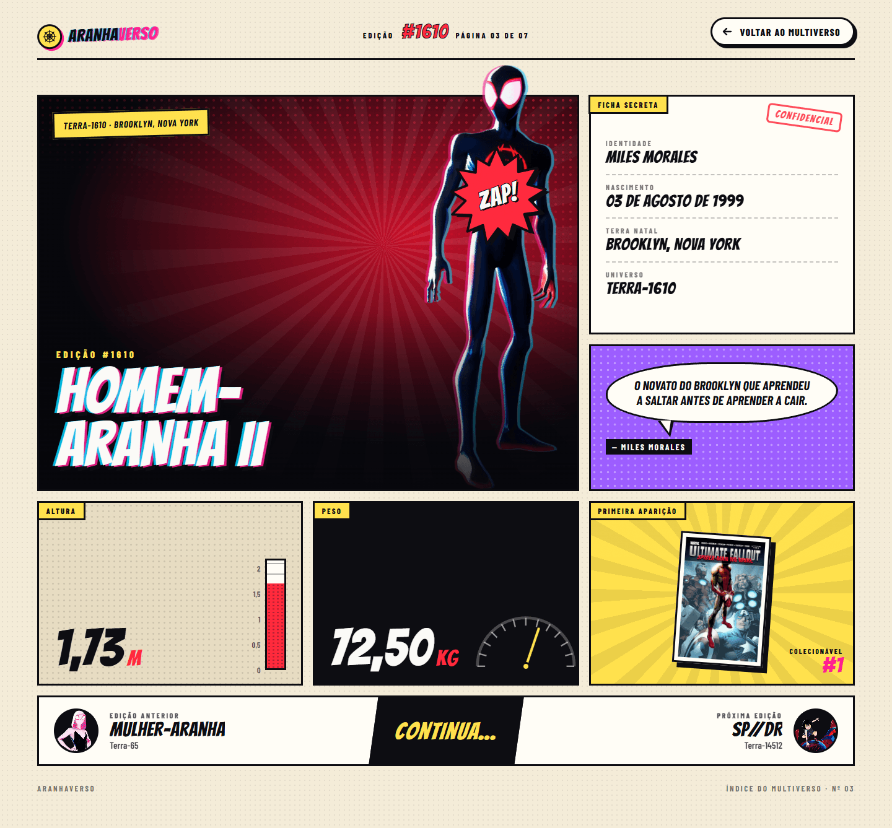
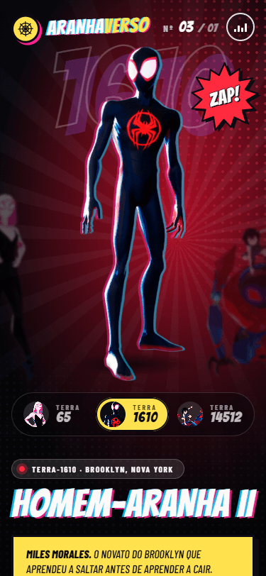

# Aranhaverso

Uma revista em quadrinhos interativa com os heróis do Aranhaverso: troque de universo com um glitch dimensional e abra a edição de cada herói.

**[Ver ao vivo](https://leandromlmoreira.github.io/spiderverse/)**




| Edição do herói | Celular |
|---|---|
|  |  |

## Funcionalidades

- **Multiverso em carrossel**: o herói em destaque fica no centro, com os vizinhos desfocados em profundidade. Troque pelas setas, pelo teclado (← →), pelo índice de universos ou arrastando (mouse e toque).
- **Parallax em camadas**: fundo de retícula, número gigante do universo, herói e onomatopeia se movem em velocidades diferentes com o ponteiro e com o arrasto.
- **Glitch dimensional**: a cada troca, o herói se fatia e desalinha as cores como uma impressão CMYK fora de registro, com rasgos de cor na tela.
- **Identidade por universo**: cada Terra tem paleta, onomatopeia (THWIP!, ZAP!, OINK!, BANG!...) e legenda próprias; o Homem-Aranha Noir aparece em preto e branco.
- **Edição do herói**: `/hero/<id>` vira uma página de quadrinho com painéis que se desenham na tela: splash com o herói saindo do quadro, ficha secreta, balão de fala, régua de altura, balança de peso, capa da primeira aparição e navegação "Continua..." para a edição anterior e a próxima.
- **Transições cinematográficas**: faixas ciano, magenta, amarelo e preto cobrem a tela entre páginas, com o nome da edição.
- **Som opcional**: voz de cada herói e efeito de transição, desligados por padrão e ativados por um botão.
- **Acessível e responsivo**: foco visível, navegação por teclado, anúncio do herói atual para leitores de tela, `prefers-reduced-motion` respeitado e layout pensado para 375 px.

## Stack

- [Next.js 15](https://nextjs.org/) (App Router, export estático) + React 19
- TypeScript
- [Framer Motion](https://motion.dev/) para carrossel, arrasto, parallax e transições
- Sass (CSS Modules)
- Fontes Bangers e Barlow Condensed (Google Fonts)
- ESLint + Prettier

## Como rodar

Pré-requisito: Node.js 18.18 ou mais recente.

```bash
git clone https://github.com/leandromlmoreira/spiderverse.git
cd spiderverse
npm install
npm run dev
```

Abra [http://localhost:3000/spiderverse](http://localhost:3000/spiderverse).

| Comando | O que faz |
|---|---|
| `npm run dev` | ambiente de desenvolvimento |
| `npm run build` | gera o site estático em `out/` |
| `npm run lint` | roda o ESLint |

## Dados dos heróis

As páginas tentam buscar a lista de heróis na API configurada em `next.config.ts` (`API_URL`). Se a requisição falhar ou vier em formato inesperado, o site usa o arquivo local `src/app/api/heroes/heroes.json`, então funciona normalmente sem a API externa. Paleta, onomatopeia e legenda de cada universo ficam em `src/app/data/universes.ts`.

## Deploy

Export estático (`output: "export"`, `basePath: "/spiderverse"`) publicado no GitHub Pages pelo workflow `.github/workflows/deploy-pages.yml` a cada push na `main`.

## Estrutura

```
src/app/
├── page.tsx                 # multiverso (carrossel)
├── hero/[id]/page.tsx       # edição do herói em painéis
├── data/                    # busca com fallback, temas por universo e mapa de imagens
├── components/
│   ├── Multiverse/          # palco, parallax, glitch, índice de universos
│   ├── ComicIssue/          # painéis da edição do herói
│   ├── PageTransition/      # cortina CMYK entre páginas
│   ├── Starburst/           # balão de onomatopeia em SVG
│   ├── SoundToggle/         # botão e hook de áudio
│   └── Wordmark/            # logotipo
├── hooks/                   # useGlitch, useMediaQuery
└── lib/                     # formatação de datas e medidas
public/
├── spiders/                 # recortes dos heróis (WebP) e capas
└── songs/                   # áudios de cada herói e da transição
```

---

<sub>Base original: projeto guiado "Criando um carrossel Parallax do Aranha Verso com React, Next.js, TypeScript e Framer Motion". Personagens e capas pertencem aos seus respectivos detentores; projeto sem fins comerciais.</sub>
